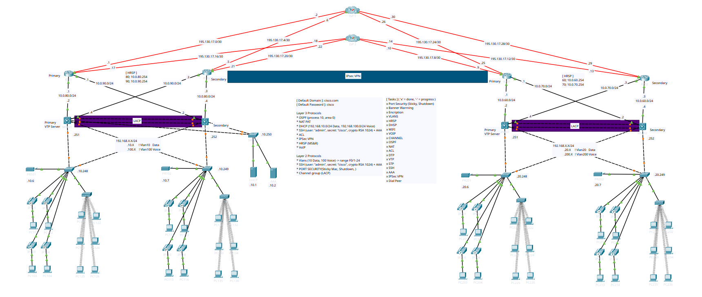
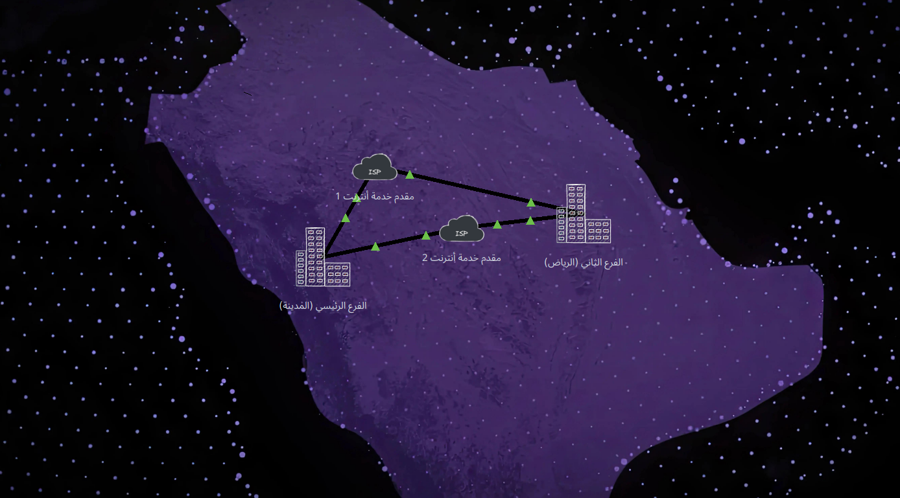
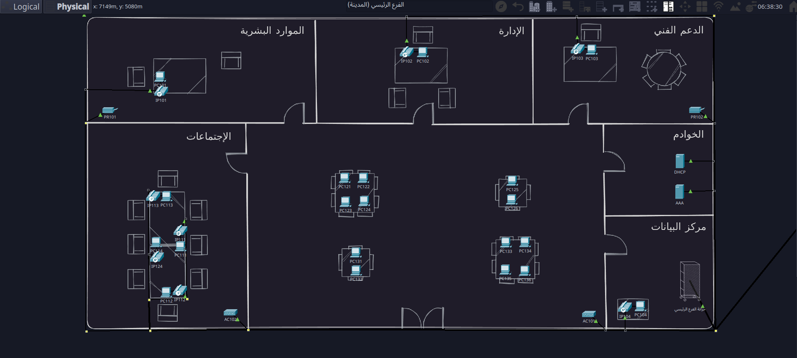
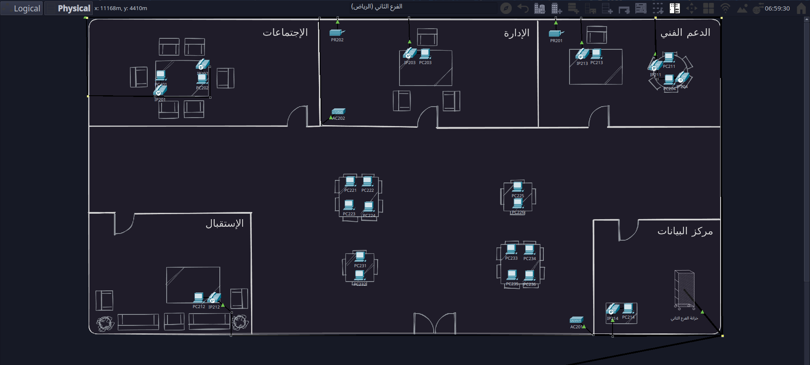

# TVTC College Computer Networks Graduation

• Designed and simulated an advanced network infrastructure using Cisco Packet Tracer.

• Implemented VLANs, OSPF, HSRP, DHCP, STP, AAA, IPSec VPN, VoIP, Dial Peer, SSH, and Port Security to build a secure and highly available network.

• Enhanced network performance, secured data, and ensured reliable and continuous connectivity between sites.

## Logical Design

## Physical Design

## Main Branch

## Second Branch 

